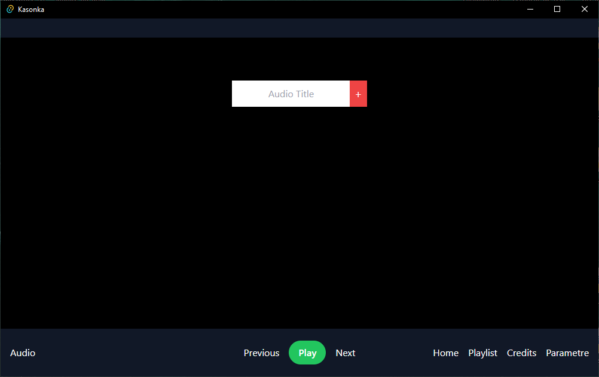
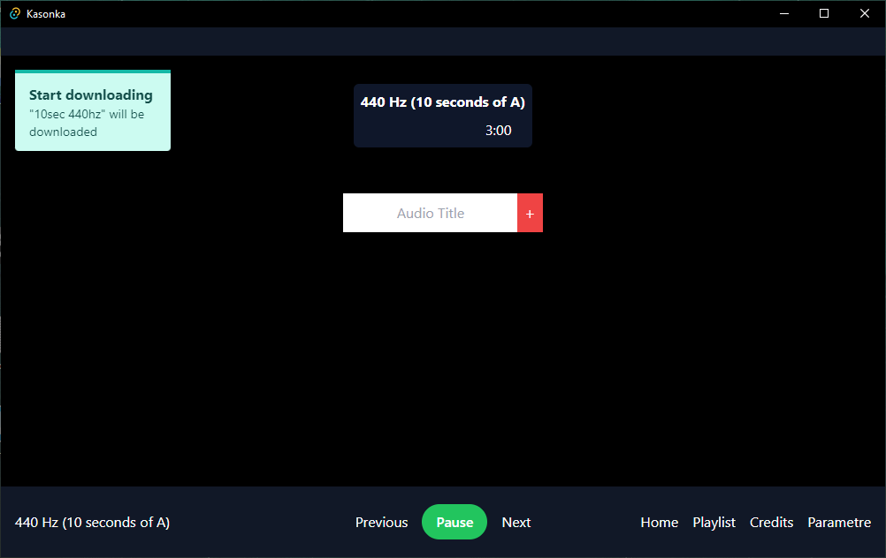

# Kasonka

 

## Description

GUI version of [KaSonKa](https://github.com/K-A-R-I-M/kasonka)

KaSonKa GUI est programme qui permettant d'ecouter l'audio de videos youtube

## Screenshots

    
    

## Installation

TBD

## Support

[K-A-R-I-M](https://github.com/K-A-R-I-M)

## Authors and acknowledgment

- [K-A-R-I-M](https://github.com/K-A-R-I-M)
- [relhamdi](https://github.com/relhamdi)
